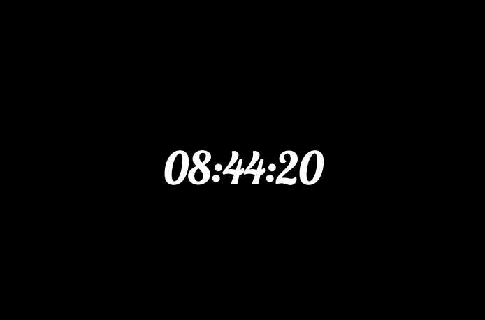
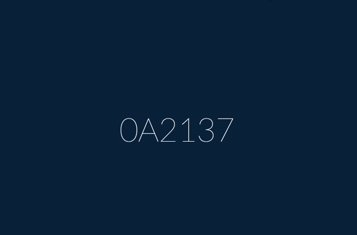

# 10.05.15 

___This homework is due by 8am, on 10/06/15___

## Objectives

### Learning Objectives

After completing this assignment, you should:

* Have a more solid understanding of the DOM and general JavaScript syntax

## Homework

### Normal Mode

- Create a JavaScript clock you see in `basic.gif` below.
  * Note it does not need to be the same font, just look similar. 
  * Have fun with the design.

- After you have done that, modify it show as a hex color and on each second tick, change the background color. See `hex.gif` below for reference.

## Deliverables

> You can use one repo for this assignment, but feel free to use multiple ones as well.

1. Push to Github
2. Push to Github Pages
3. Comment on the issue assigned to you and close the issue

## Hard Mode

  1. Create a new version (separate project), but this time have it convert to actual HEX values. See `advanced.gif` screenshot below.

## Resources

- [Window Timers](https://developer.mozilla.org/en-US/docs/Web/API/WindowTimers)
- [JavaScript Date](https://developer.mozilla.org/en-US/docs/Web/JavaScript/Reference/Global_Objects/Date)
