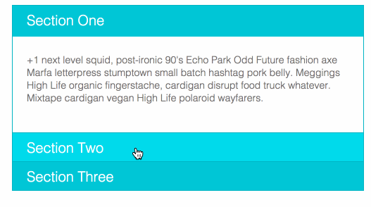

# 10/06/15

___This homework is due by 8am, on 10/07/15___

## Objectives

### Learning Objectives

After completing this assignment, you should…

* Understand how to use jQuery to manipulate the DOM
* Understand how CSS transitions work and why they are beneficial

### Performance Objectives

After completing this assignment, you be able to effectively use

* Use jQuery
* Use CSS Animations

## Normal Mode

* Build a jQuery Accordion WITHOUT using `slideUp`, `slideDown`, or `slideToggle`. Hint: use `addClass` & `removeClass`.
* Only CSS3 transitions allowed. It should work for 2 or more sections.
* Each paragraph in each section of the accordion should be a different length. It's important to learn how to deal with variable content length.
* Use the image below as an example

## Deliverables

1. Comment with a link to Github Pages on the Issue that is assigned to you.
2. Comment with a link to the Github Repo for this project

## Hard Mode

* Build a jQuery image carousel that will continue to show the images.
* Do not use any of the jQuery animation methods like `fadeIn` or `fadeOut` or even `animate`
* Use the image below as an example

