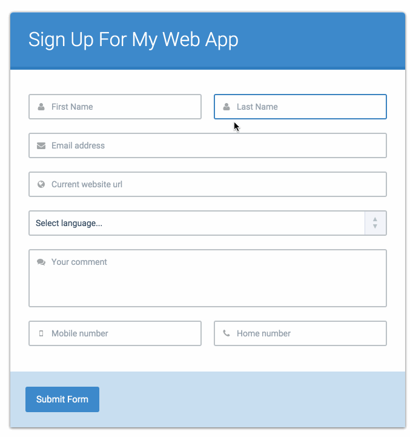
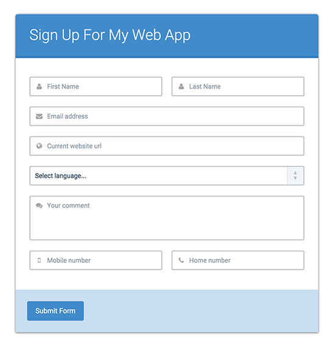
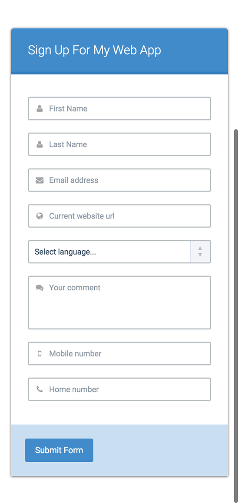

# 10/13/15 

___This homework is due by 8am, on 10/14/15___

### Pair Programming Groups

For this part of the assignment, you will be broken up into pairs and will be required to use the style of [Pair Programming](http://en.wikipedia.org/wiki/Pair_programming) in order to complete the assignment.

| Person [A] | Person [B] |
|------------|------------|
| Amit       | Vince      |
| Jeff       | Isaac      |
| Jonny      | John       |
| Sarah      | Justin     |
| Maryam     | Caroline   |
| Josh       | Charlie    |
| Shalmali   | Hyona      |
| Michael    | Boyzie     |
| Thomas     | Jef        |
| Luke       | Wes        |
| Andrew     | Danny      |
| Kool       | Jesse      |
| Cori       | Kevin      |
| Hadiya     | Jontae     |

### Learning Objectives

After completing this assignment, you should:

* Understand how to collaborate using Git & Github
* Understand the basics of jQuery `$.ajax()` and `$.getJSON()`
* Understand how to use a jQuery based `Promise` and how Async works.

## Deliverables

1. For Pair Programming - Put a link to the pull request you either made or accepted.

## Normal Mode (Pair Programming)

1. Use this [Form Data](http://json-data.herokuapp.com/forms) to create a form on a page.
2. Person [A] should set up the project and then write the JS to make the form visible.
3. Person [B] should fork the project and add in the styles you see in the `Full` screenshot below.
4. Person [B] should then create a Pull Request
5. Person [A] should then accept the Pull Request
6. Person [A] should then add in responsive styles like the `Mobile` screenshot below.
7. Give each other a high five.

## Screenshots

#### Animated

#### Full

#### Mobile

## Resources

* [Form Data](http://json-data.herokuapp.com/forms)
* [Font Awesome](https://fortawesome.github.io/Font-Awesome/) for the icons.

